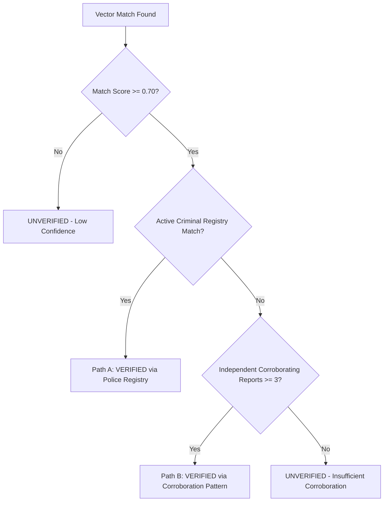

# KAVACH — Security Architecture & Threat Model

## 1. Threat Model & Security Objectives

Kavach handles high-sensitivity citizen safety disclosures, live geospatial coordinates, and law enforcement intelligence. The security architecture is designed to mitigate five critical threat vectors:

| Threat Vector | Potential Impact | Kavach Mitigation Strategy |
| :--- | :--- | :--- |
| **Unauthorized Victim Tracking** | Exposing live citizen locations to attackers | Ephemeral session tokens, strict role isolation, zero persistent raw telemetry exposure |
| **Perpetrator Retaliation / PII Leak** | Exposing victim identity to law enforcement leaks or compromised dashboards | Deterministic HMAC-SHA256 tokenization and regex scrubbing before serialization |
| **False Accusation by AI Matching** | Unfair profiling based purely on LLM hallucination | Dual-path statutory verification engine (Path A: Registry / Path B: Corroboration threshold $N \ge 3$) |
| **Privilege Escalation** | Regular user accessing law enforcement dashboard | Cryptographic JWT claims verified via FastAPI dependency injection (`require_authority_role`) |
| **Tampered Incident Records** | Altering safety complaint timelines | Immutable append-only audit trail logging all agent actions |

---

## 2. Authentication & Credential Storage

### 2.1. Password Hashing
All user and authority passwords are encrypted using **bcrypt** with a salt work factor of 12. Passwords are never stored in plaintext or logged.

```python
# app/security/hashing.py
from passlib.context import CryptContext

pwd_context = CryptContext(schemes=["bcrypt"], deprecated="auto")

def verify_password(plain_password: str, hashed_password: str) -> bool:
    return pwd_context.verify(plain_password, hashed_password)

def get_password_hash(password: str) -> str:
    return pwd_context.hash(password)
```

### 2.2. JWT Token Issuance & Verification
Authentication utilizes stateless JSON Web Tokens signed with HMAC-SHA256:
- Token Expiration: 1440 minutes (24 hours) for demo environments.
- Payload Claims:
  - `sub`: User email or username.
  - `role`: Role identifier (`ROLE_USER` or `ROLE_AUTHORITY`).
  - `exp`: UTC expiration timestamp.

---

## 3. Role-Based Access Control (RBAC)

Kavach enforces RBAC at the FastAPI router level using dependency injection:

```python
# app/security/auth.py
def require_authority_role(current_user: User = Depends(get_current_user)) -> User:
    if current_user.role != "ROLE_AUTHORITY":
        raise HTTPException(
            status_code=status.HTTP_403_FORBIDDEN,
            detail="Access forbidden: Authority credentials (ROLE_AUTHORITY) required."
        )
    return current_user
```

### Access Matrix:

| Resource / Endpoint | Unauthenticated | `ROLE_USER` | `ROLE_AUTHORITY` |
| :--- | :---: | :---: | :---: |
| `/api/auth/token` | Read | Read | Read |
| `/api/gps/ping`, `/safe-route` | Read / Write | Read / Write | Read / Write |
| `/api/therapy/*` | Write (Ephemeral) | Read / Write | Denied |
| `/api/cases` (Citizen Personal) | Denied | Read / Write (Own Cases) | Read |
| `/api/authority/*` | **401 Unauthorized** | **403 Forbidden** | **200 Authorized** |
| `/api/matching/verify/*` | **401 Unauthorized** | **403 Forbidden** | **200 Authorized** |

---

## 4. Multi-Source Verification Safeguard

To eliminate false accusations and irresponsible algorithmic profiling, the `VerificationAgent` enforces deterministic verification gates before any culprit match can be marked `VERIFIED`:



---

## 5. Network & API Hardening

- **CORS Protection**: Explicitly restricts origins to frontend client origins.
- **Input Validation**: Strongly typed Pydantic v2 schemas reject malformed payloads before processing.
- **Fail-Safe AI Execution**: All LLM calls have deterministic fallback engines to ensure continuous operation without cloud credential leakage.
